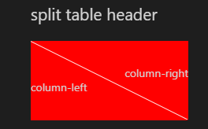
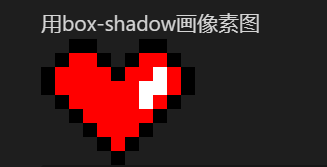

# CSS-shapes
原生CSS实现各种形状

源码都写在了这个markdown里，但是gayhub的markdown解析不支持 `<style>` 和类名之类，所以看不到效果，下载源文件放VSC看效果最佳🍻

## split table header



<div class="split-header">
  <div class="right"></div>
  <div class="left"></div>
</div>

<style>
.split-header{
  width:200px;
  height:100px;
  background:#fff;
  position:relative;
}
.split-header .right{
  width:0;
  height:0;
  border-right:200px solid red;
  border-bottom:100px solid transparent;
}
.split-header .right:before{
  content:'column-right';
  position:absolute;
  right:0;
  top:30px;
}
.split-header .left{
  width:0;
  height:0;
  border-left:200px solid red;
  border-top:100px solid transparent;
  margin-top: -99px;
}
.split-header .left:before{
  content:'column-left';
  position:absolute;
  left:0;
  bottom:30px;
}
</style>

```html
<div class="split-header">
  <div class="right"></div>
  <div class="left"></div>
</div>
<style>
.split-header{
  width:200px;
  height:100px;
  background:#fff;
  position:relative;
}
.split-header .right{
  width:0;
  height:0;
  border-right:200px solid red;
  border-bottom:100px solid transparent;
}
.split-header .right:before{
  content:'column-right';
  position:absolute;
  right:0;
  top:30px;
}
.split-header .left{
  width:0;
  height:0;
  border-left:200px solid red;
  border-top:100px solid transparent;
  margin-top: -99px;
}
.split-header .left:before{
  content:'column-left';
  position:absolute;
  left:0;
  bottom:30px;
}
</style>
```


## 用box-shadow画像素图



<div class="pixel-shape"></div>

<style>
.pixel-shape{
  box-shadow:4em 0em #000, 
  3em 1em #000, 
  2em 2em #000, 
  1em 3em #000, 
  0em 4em #000, 
  -1em 3em #000, 
  -2em 2em #000, 
  -3em 1em #000, 
  -4em 0em #000, 
  -5em -1em #000, 
  -5em -2em #000, 
  -4em -3em #000, 
  -3em -4em #000, 
  -2em -4em #000, 
  -1em -3em #000, 
  0em -2em #000, 
  1em -3em #000, 
  2em -4em #000, 
  3em -4em #000, 
  4em -3em #000, 
  5em -2em #000, 
  5em -1em #000, 
  2em 0em #fff, 
  2em -1em #fff, 
  3em -1em #fff, 
  3em -2em #fff, 
  4em -1em red, 
  4em -2em red, 
  3em 0em red, 
  3em -3em red, 
  2em 1em red, 
  2em -2em red, 
  2em -3em red, 
  1em -2em red, 
  1em -1em red, 
  1em 0em red, 
  1em 1em red, 
  1em 2em red, 
  1em 3em red, 
  0em -1em red, 
  0em 0em red, 
  0em 1em red, 
  0em 2em red, 
  0em 3em red, 
  -1em -2em red, 
  -1em -1em red, 
  -1em 0em red, 
  -1em 1em red, 
  -1em 2em red, 
  -1em 3em red, 
  -2em -3em red, 
  -2em -2em red, 
  -2em -1em red, 
  -2em 0em red, 
  -2em 1em red, 
  -3em -3em red, 
  -3em -2em red, 
  -3em -1em red, 
  -3em 0em red, 
  -4em -1em red, 
  -4em -2em red;
    background: red;
    width: 1em;
    height: 1em;
    overflow: hidden;
    margin: 4em 5em;
  }
</style>

```html
<div class="pixel-shape"></div>

<style>
.pixel-shape{
  box-shadow:4em 0em #000, 
  3em 1em #000, 
  2em 2em #000, 
  1em 3em #000, 
  0em 4em #000, 
  -1em 3em #000, 
  -2em 2em #000, 
  -3em 1em #000, 
  -4em 0em #000, 
  -5em -1em #000, 
  -5em -2em #000, 
  -4em -3em #000, 
  -3em -4em #000, 
  -2em -4em #000, 
  -1em -3em #000, 
  0em -2em #000, 
  1em -3em #000, 
  2em -4em #000, 
  3em -4em #000, 
  4em -3em #000, 
  5em -2em #000, 
  5em -1em #000, 
  2em 0em #fff, 
  2em -1em #fff, 
  3em -1em #fff, 
  3em -2em #fff, 
  4em -1em red, 
  4em -2em red, 
  3em 0em red, 
  3em -3em red, 
  2em 1em red, 
  2em -2em red, 
  2em -3em red, 
  1em -2em red, 
  1em -1em red, 
  1em 0em red, 
  1em 1em red, 
  1em 2em red, 
  1em 3em red, 
  0em -1em red, 
  0em 0em red, 
  0em 1em red, 
  0em 2em red, 
  0em 3em red, 
  -1em -2em red, 
  -1em -1em red, 
  -1em 0em red, 
  -1em 1em red, 
  -1em 2em red, 
  -1em 3em red, 
  -2em -3em red, 
  -2em -2em red, 
  -2em -1em red, 
  -2em 0em red, 
  -2em 1em red, 
  -3em -3em red, 
  -3em -2em red, 
  -3em -1em red, 
  -3em 0em red, 
  -4em -1em red, 
  -4em -2em red;
    background: red;
    width: 1em;
    height: 1em;
    overflow: hidden;
    margin: 4em 5em;
  }
</style>
```

